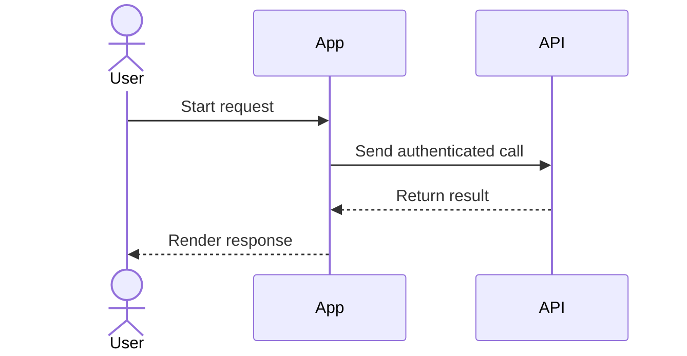

# Codex Obsidian Writer

Write technical documentation for an existing Obsidian vault. Stay Markdown-first, but switch to Mermaid, JSON Canvas, or Obsidian Bases when those formats fit better.

## Scope

- Works inside an existing Obsidian vault only
- Does not scaffold a new vault
- Prefers editing existing notes over creating parallel duplicates
- Uses Obsidian-native formats so docs stay readable in plain text and in Obsidian

## Routing Rules

Choose the lightest artifact that fits:

| Need | Format | Why |
| --- | --- | --- |
| Architecture note, ADR, runbook, API doc, module doc | `.md` | Default durable format |
| Inline flow, sequence, state, ER, or timeline diagram | Mermaid in `.md` | Readable in source and preview |
| Spatial map, cluster board, freeform relationships, planning wall | `.canvas` | Layout matters more than text flow |
| Queryable docs index, inventory, dashboard over note properties | `.base` | Structured view over notes |

Use Mermaid before Canvas when the diagram still reads clearly as text.

## Existing Obsidian Skills

Reuse these when they are available instead of re-explaining their syntax:

- `codex-obsidian-markdown` for note structure, frontmatter, callouts, wikilinks, embeds, and Mermaid blocks
- `codex-obsidian-canvas` for `.canvas` files
- `codex-obsidian-bases` for `.base` files
- `codex-obsidian-cli` when interacting with a running Obsidian app or vault operations matter
- `codex-obsidian-web-import` when turning web docs into clean Markdown source material

If those skills are not available, still produce valid Obsidian-friendly output with the same routing rules.

## Workflow

1. Confirm the target is an existing vault path or an existing note set.
2. Check whether the requested doc should update an existing note before creating a new one.
3. Pick the artifact type:
   - `.md` by default
   - Mermaid when the diagram can live inline
   - `.canvas` when layout is part of the meaning
   - `.base` when the user needs a structured index
4. Add consistent properties and wikilinks.
5. Keep note titles and links stable and boring.

## Default Properties

Use these when the note is technical documentation:

```yaml
---
type: module-doc
status: draft
owner: team-or-person
tags:
  - architecture
created: 2026-07-02
updated: 2026-07-02
---
```

Adjust `type`, `status`, and `tags` to the note kind. Keep `created` stable and bump `updated` on meaningful edits.

## Link Conventions

Prefer Obsidian wikilinks for vault content:

- `[[Architecture Overview]]`
- `[[ADR-001 Use Mermaid for Sequence Diagrams]]`
- `[[Runbook - Rotate API Keys]]`
- `[[Auth Module]]`

Link related docs at the end or in a `Related` section instead of repeating context across notes.

## Templates

### Module Doc

````markdown
---
type: module-doc
status: draft
owner: team-or-person
tags: [architecture, module]
created: 2026-07-02
updated: 2026-07-02
---
# Module Name

## Purpose

## Responsibilities

## Inputs and Outputs

## Dependencies

## Failure Modes

## Related
- [[Architecture Overview]]
- [[Runbook - Example]]
````

### ADR

````markdown
---
type: adr
status: proposed
owner: team-or-person
tags: [adr, architecture]
created: 2026-07-02
updated: 2026-07-02
---
# ADR-001 Decision Title

## Context

## Decision

## Consequences

## Alternatives Considered

## Related
- [[Architecture Overview]]
````

### Runbook

````markdown
---
type: runbook
status: active
owner: team-or-person
tags: [runbook, operations]
created: 2026-07-02
updated: 2026-07-02
---
# Runbook - Task Name

## When to Use

## Preconditions

## Steps

## Verification

## Rollback

## Related
- [[Incident Notes]]
````

### API Note

````markdown
---
type: api-doc
status: draft
owner: team-or-person
tags: [api]
created: 2026-07-02
updated: 2026-07-02
---
# API Name

## Purpose

## Endpoints

| Endpoint | Method | Auth | Description |
| --- | --- | --- | --- |

## Request and Response Notes

## Failure Cases

## Related
- [[Architecture Overview]]
````

## Mermaid Guidance

Use Mermaid inside Markdown for:

- sequence diagrams
- flowcharts
- ER diagrams
- state diagrams
- gantt charts

Example:

````markdown

````

## Canvas Guidance

Create `.canvas` when the user needs:

- system landscape maps
- clustered concepts
- visual dependency walls
- freeform exploration with spatial grouping

For Canvas boards:

- use short text nodes
- group related nodes
- avoid dense prose in nodes
- keep labels aligned with linked note titles where possible

Minimal board structure:

```json
{
  "nodes": [],
  "edges": []
}
```

## Bases Guidance

Create `.base` files for:

- documentation indexes
- ADR catalogs
- runbook dashboards
- API inventories

Minimal docs index shape:

```yaml
filters:
  or:
    - 'type == "module-doc"'
    - 'type == "adr"'
    - 'type == "runbook"'
views:
  - type: table
    name: "Docs"
    order:
      - file.name
      - type
      - status
      - owner
      - updated
```

## Acceptance Path

For a request like "document this auth flow in my existing vault":

1. Update or create a Markdown architecture note.
2. Add frontmatter with doc properties.
3. Use Mermaid for the auth sequence if it fits inline.
4. Add wikilinks to related ADRs, modules, and runbooks.
5. Only create Canvas or Base files if the user asked for spatial mapping or an indexed dashboard.
